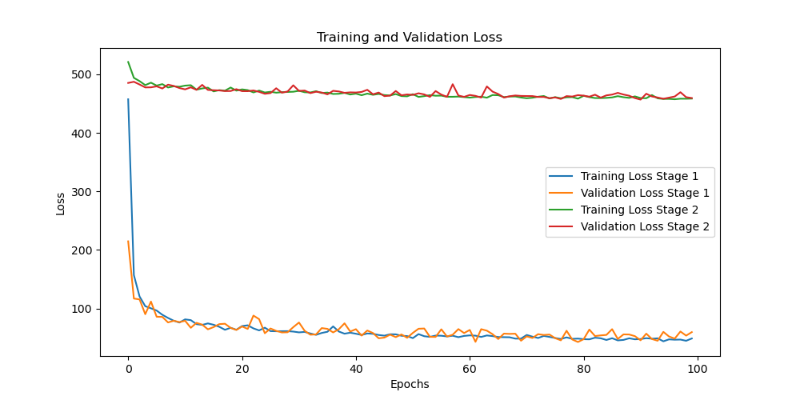

# About
We are trying to modify and train the WLDO model using Animal3D dataset.

- Orginal WLDO paper: Who Left the Dogs Out?

Evaluation and demo code for our ECCV 2020 paper: *Who Left the Dogs Out? 3D Animal Reconstruction with Expectation Maximization in the Loop*. [Project page](https://sites.google.com/view/wldo/home),[Paper](https://arxiv.org/abs/2007.11110)and [Github](https://github.com/benjiebob/WLDO)


- Original Animal3D dataset: Animal3D: A Comprehensive Dataset of 3D Animal Pose and Shape. [Project page](https://xujiacong.github.io/Animal3D/), [Paper](https://arxiv.org/abs/2308.11737) and [Github](https://github.com/XuJiacong/Animal3D)


## Install
Create a new env:

`conda create -n wldo python=3.9.0`

`conda activate wldo`

Install pytorch:

`pip install torch==1.12.1+cu116 torchvision==0.13.1+cu116 torchaudio==0.12.1 --extra-index-url https://download.pytorch.org/whl/cu116`

Install requirements:

`pip install -r requirements.txt`

Install neural renderer: (Because we cannot install directly, so, we build it again)

`cd neural_renderer`

`python setup.py install`

If it is missing any libs, please check in the [env.txt](env.txt) file

### Datasets

Follow the instructions [on the Animal3D project page](https://xujiacong.github.io/Animal3D/) to download Animal3D annotations and images.

Add the dataset into data folder

```
data/
├── animal3d/
│ ├── images/
│ └── masks/
├── test.json
└── train.json
```

### Modification
- We modified the output of Shape predictor in WLDO from 26 paras to 41 paras based on Animal3d dataset.
- The loss function is L2 based on WLDO paper and the shape and pose prior loss are included based on Animal3D paper.
- 26 Keypoints are extracted from vertices using mean value (just guess, dont have any instructions) from specific positions  from `train.json` file, we modified it the `global_utils/smal_model/smal_torch.py`. And the `config.py` file are also modified in `MODEL_JOINTS`, `EVAL_KEYPOINTS`
- Create a `train.py` file, including 2 stage training based on Supplementary material of WLDO paper.

## Trainning
We set the 100 epochs on each stage

`python train.py`

Loss results:


## Demo results
`python demo.py`

- Currently we have trained it but the results are not good, it does not have an animal-like shape.
- If you have any comments or suggestions, I would really appreciate it if you could share them with us. Thank you very much!

## Contribute
Please create a pull request or submit an issue if you would like to contribute.

## Licensing
Please follows the license from two original projects.

By downloading this dataset, you agree to the [Creative Commons Attribution-NonCommercial 4.0 International license](https://creativecommons.org/licenses/by-nc-sa/4.0/). This license allows users to use, share and adapt the dataset, so long as credit is given to the authors (e.g. by citation) and the dataset is not used for any commercial purposes.

THIS SOFTWARE AND ANNOTATIONS ARE PROVIDED BY THE COPYRIGHT HOLDERS AND CONTRIBUTORS "AS IS" AND ANY EXPRESS OR IMPLIED WARRANTIES, INCLUDING, BUT NOT LIMITED TO, THE IMPLIED WARRANTIES OF MERCHANTABILITY AND FITNESS FOR A PARTICULAR PURPOSE ARE DISCLAIMED. IN NO EVENT SHALL THE COPYRIGHT OWNER OR CONTRIBUTORS BE LIABLE FOR ANY DIRECT, INDIRECT, INCIDENTAL, SPECIAL, EXEMPLARY, OR CONSEQUENTIAL DAMAGES (INCLUDING, BUT NOT LIMITED TO, PROCUREMENT OF SUBSTITUTE GOODS OR SERVICES; LOSS OF USE, DATA, OR PROFITS; OR BUSINESS INTERRUPTION) HOWEVER CAUSED AND ON ANY THEORY OF LIABILITY, WHETHER IN CONTRACT, STRICT LIABILITY, OR TORT (INCLUDING NEGLIGENCE OR OTHERWISE) ARISING IN ANY WAY OUT OF THE USE OF THIS SOFTWARE, EVEN IF ADVISED OF THE POSSIBILITY OF SUCH DAMAGE.
git pull github.com:vandoitruong/WLDO_Animal3D.git master
